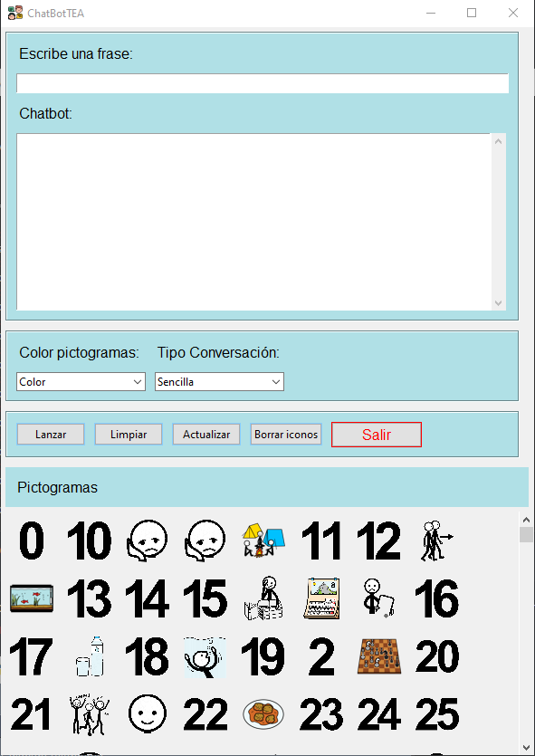
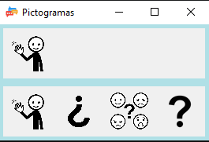

# ChatbotTEA
Programa de chat con chatgpt 3.5 a pictogramas para personas con TEA,
hay que tener en cuenta los acentos, porque puede que no se muestran algunos pictogramas.

Por defecto aparecen los pictogramas a color, se puede elegir en blanco y negro en el desplegable

frase escrita y respuesta del chat

Chat de pictogramas

